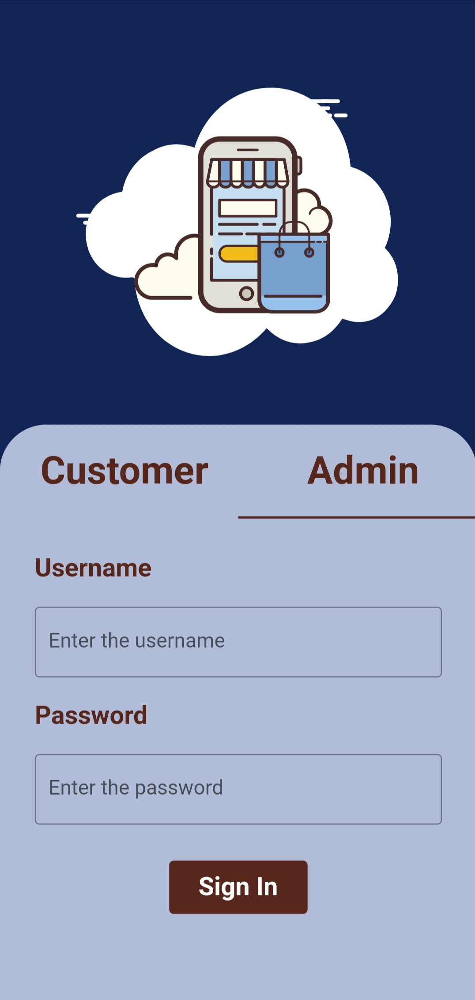
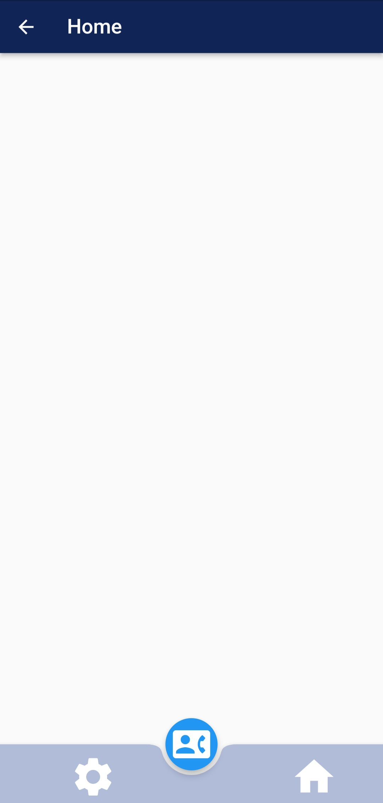

Screenshots:

## Author

👤 **Abinayan Ratnasingam**

- Github: https://github.com/AbinayanRatna
- LinkedIn: https://www.linkedin.com/in/abinayan-ratnasingam-5092b3214/

## Show your support

Give a ⭐️ if this project helped you!
